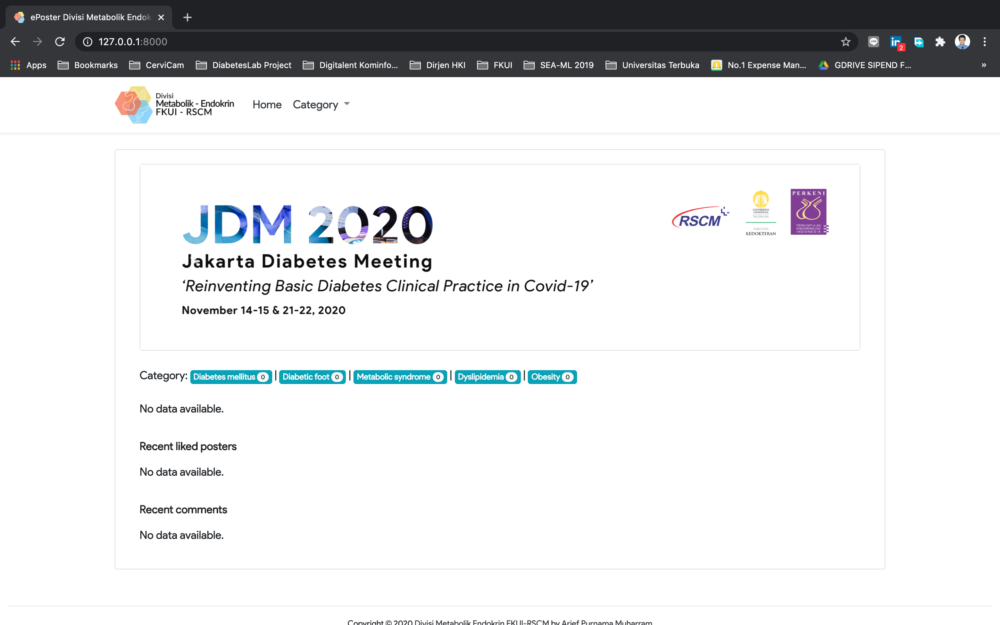
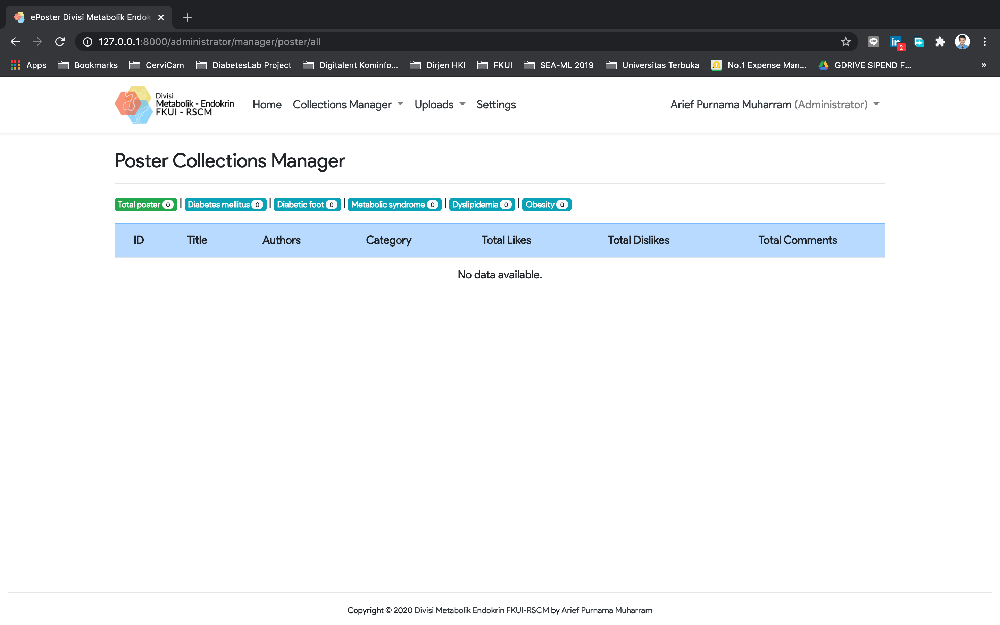
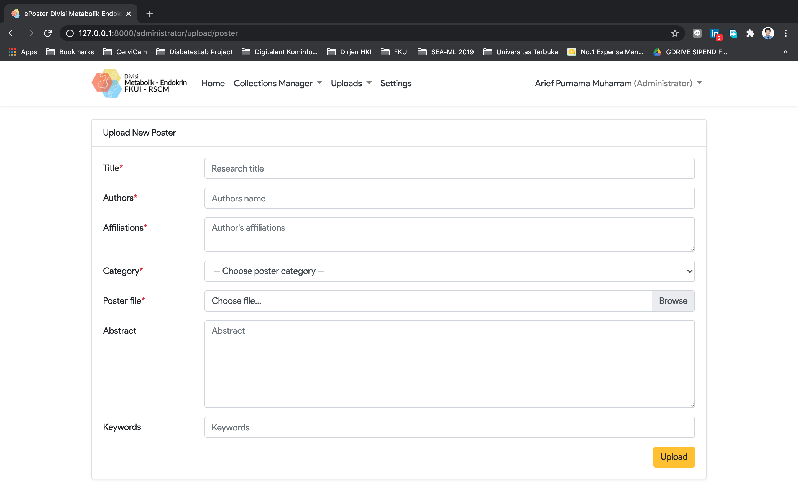

# Poster Web Platform
ePoster web platform for Endocrine and Metabolism Division, Department of Internal Medicine RSUPN Dr. Cipto Mangunkusumo Jakarta, Faculty of Medicine, Universitas Indonesia, Indonesia. Build using Laravel framework.







## System requirements
- Web server, NginX is preferable
- PHP version 7.4
- DBMS, MySQL is perferable
- Composer

## Installation
1. Clone this repository.
2. Install system packages using `composer install` command.
3. Copy `.env.example` and rename it to `.env`.
4. In `.env`, edit database connection section.
5. Do database migration using `php artisan migrate`.
6. Do database seeding using `php artisan db:seed`
7. Generate key using `php artisan key:generate`
8. System ready to serve. For any additional information, please refer to Laravel's official docummentation.

## System update
For future system update, you can use `.sysupdate.sh` shell script included in this repository. In order use it please follow this steps for the first-time setup:

1. Change file permission by `chmod +x sysupdate.sh`.
2. Run shell script by using `./sysupdate.sh`.

Now you can do system update automatically by typing `./sysupdate.sh`.

## Administrator account
You can login as administrator by clicking `login` button on top right corner of navigation bar or simply by adding `/login` in the web address. Here is the default administrator account:
```
Username: dummy@dummy.com
Password: dummy123456
```
Please change it after you successfully install the system.

## Copyright
Copyright &copy; 2020 Divisi Metabolik Endokrin FKUI-RSCM by Arief Purnama Muharram. You can use it freely for noncommercial purpose.
